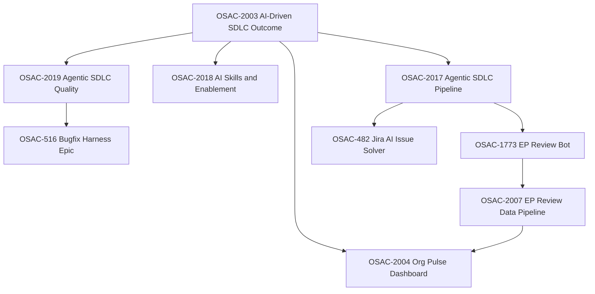

# OSAC-2019: Agentic SDLC Quality — Status & Recommended Focus

> **Temporary planning doc** (OSAC-2019). Remove or relocate when execution is underway.

## Current Plan Status (2026-07-07)

**Phase:** Planning complete. Execution not started.

**Assignment:** [OSAC-2019](https://redhat.atlassian.net/browse/OSAC-2019) — Agentic SDLC Quality, under outcome [OSAC-2003](https://redhat.atlassian.net/browse/OSAC-2003).

**Strategic direction (Eran):** Focus on EP/PRD review quality + Org Pulse observability. Do **not** migrate bugfix eval into osac-workspace (PR #47 closed).

**Execution priority:**

1. **Sync** — Confirm scope pivot with Eran; coordinate OSAC-2073 with Andy
2. **First PR** — [OSAC-2073](https://redhat.atlassian.net/browse/OSAC-2073) SHA provenance in `flightctl/ai-workflows` publish skills
3. **Jira hygiene** — Close tickets for already-merged PRs (#101, #103, #105)
4. **Optional / if capacity** — [OSAC-2137](https://redhat.atlassian.net/browse/OSAC-2137) GitLab collector fix (Itzik's lane; marker-based classification)
5. **After Eran OK** — Propose child epic under OSAC-2019 for PRD/design eval harness
6. **Later** — Scaffold `osac-ep-eval` repo (modeled on osac-bugfix-eval)

**Explicitly deprioritized:** OSAC-2136, OSAC-2145, OSAC-2028 (code merged); workspace bugfix eval migration.

## Conversation Ingest Summary

| Artifact | Status | Key takeaway |
|----------|--------|--------------|
| [OSAC-2019](https://redhat.atlassian.net/browse/OSAC-2019) | In Progress | Feature under **Improve** pillar of outcome [OSAC-2003](https://redhat.atlassian.net/browse/OSAC-2003) |
| [osac-workspace PR #47](https://github.com/osac-project/osac-workspace/pull/47) | Closed, not merged | Eran: "Probably don't belong in this repo" — bugfix eval stays external |
| [eranco74/osac-bugfix-eval](https://github.com/eranco74/osac-bugfix-eval) | Active standalone repo | 11 real-bug cases; 8/11 → 11/11 after skill improvements |
| [Org Pulse RFE Review](https://org-pulse-ecosystem-poc.apps.rosa.hcmais01ue1.s9m2.p3.openshiftapps.com/#/ai-impact/rfe-review) | Live POC | Surfaces AI EP/PRD review scores |
| [OSAC-2073](https://redhat.atlassian.net/browse/OSAC-2073) | New, Andy assigned | Embed workspace + ai-workflows SHAs at publish time for provenance |
| EP Review GitHub Action | Deployed on `enhancement-proposals` | [`ep-review.yml`](https://github.com/osac-project/enhancement-proposals/blob/main/.github/workflows/ep-review.yml) |

**Eran's direction:** Focus eval/monitoring on the **EP/PRD review front** (not migrating bugfix eval into osac-workspace). Sync with Andy on [OSAC-2073](https://redhat.atlassian.net/browse/OSAC-2073).

---

## Jira Hierarchy (AI SDLC Outcome)

### OSAC-2019 scope today

- **Stated goal:** Eval-driven quality loops and backtesting against real OSAC bugs
- **Only child epic linked:** [OSAC-516](https://redhat.atlassian.net/browse/OSAC-516) (AI Bugfix Harness)
- **Gap:** No Jira child epic yet for **PRD/design review eval**

---

## What's Already Implemented

### 1. Bugfix eval harness (external, mature)

- Standalone repo: [eranco74/osac-bugfix-eval](https://github.com/eranco74/osac-bugfix-eval)
- 11 cases from real OSAC bugs (MGMT-23473 through MGMT-24226)
- 5 judges: `correct_repo`, `correct_files`, `tests_added`, `artifacts_produced`, `fix_correctness`
- Results drove workspace improvements (CONVENTIONS.md, CLAUDE.md Common Fix Locations, etc.)
- [OSAC-1308](https://redhat.atlassian.net/browse/OSAC-1308) closed; PR #47 closed without merge

### 2. EP/PRD automated review pipeline (production path)

| Layer | Status | Details |
|-------|--------|---------|
| Review skills | Done | `skills/prd-review/SKILL.md`, `skills/ep-review/SKILL.md` |
| GitHub Action | Done | `ep-review.yml` on `enhancement-proposals` |
| Bot execution | Live | Clones osac-workspace for skills, Vertex AI, PR comments |
| Data pipeline | Mostly done | OSAC-2007: fetcher, ConfigMap, PRD/design view split |
| Dashboard | Live POC | Org Pulse RFE Review + Feature Review views |

### 3. Workspace AI SDLC foundation

- `AI-assisted-development-workflow.md`, `bootstrap.sh`, `.design/context/`, `presentations/ai-assisted-sdlc.md`

---

## What's Lacking / Open Work

### A. Bugfix harness (OSAC-516 — still In Progress)

| Ticket | Assignee | Status | Work |
|--------|----------|--------|------|
| [OSAC-508](https://redhat.atlassian.net/browse/OSAC-508) | Itzik | Review | Test iteration cap — ai-workflows PR #49 |
| [OSAC-509](https://redhat.atlassian.net/browse/OSAC-509) | Andy | New | Skip deep exploration when root cause explicit |
| [OSAC-515](https://redhat.atlassian.net/browse/OSAC-515) | Unassigned | New | Upstream `setup_command` to agent-eval-harness |

### B. EP/PRD review quality loop

| Ticket | Status | Gap |
|--------|--------|-----|
| [OSAC-2073](https://redhat.atlassian.net/browse/OSAC-2073) | New (Andy) | No SHA provenance in published PRD/design docs |
| [OSAC-1968](https://redhat.atlassian.net/browse/OSAC-1968) | Review | EP review skill scoring alignment with Org Pulse |
| [OSAC-2136](https://redhat.atlassian.net/browse/OSAC-2136) | Merged (#101); Jira still New | Workflow triggers fixed |
| [OSAC-2137](https://redhat.atlassian.net/browse/OSAC-2137) | New, unassigned | **Optional** — GitLab collector filename vs marker classification |
| [OSAC-2145](https://redhat.atlassian.net/browse/OSAC-2145) | Merged (#103); Jira still New | Dual PR comment overwrite fixed |
| [OSAC-2028](https://redhat.atlassian.net/browse/OSAC-2028) | Merged (#105); Jira still New | Cost/token tracking added |
| [OSAC-2146](https://redhat.atlassian.net/browse/OSAC-2146) | New | Feature review status derivation |

**Not done:** PRD/design backtest eval harness; PR CI eval gates; child epic for EP review eval strategy.

---

## Strategic Read

The **next quality loop**:

1. **Observe** — Org Pulse collects bot review scores (optional collector fix OSAC-2137)
2. **Diagnose** — SHA provenance (OSAC-2073)
3. **Improve** — Iterate `prd-review` / `ep-review` skills
4. **Validate** — Backtest against golden examples (not yet built)

---

## Recommended Next Steps

### Immediate

1. Sync with Eran — confirm second child epic for "EP Review Quality Loop"
2. Sync with Andy on OSAC-2073
3. Review Org Pulse RFE Review + Feature Review dashboards

### Short-term contributions

| Priority | Ticket | Repo | Notes |
|----------|--------|------|-------|
| **1 — do first** | OSAC-2073 | `flightctl/ai-workflows` | SHA provenance in publish |
| **2 — optional** | OSAC-2137 | `org-pulse-data` (GitLab) | Collector fix; coordinate with Itzik |
| **3 — later** | OSAC-508/509 | `ai-workflows` | Close OSAC-516 remainders |
| **Done** | OSAC-2136, 2145, 2028 | `enhancement-proposals` | Merged; close Jira tickets |

### Medium-term

1. Propose child epic: **PRD/Design Review Eval Harness**
2. Model on [osac-bugfix-eval](https://github.com/eranco74/osac-bugfix-eval)
3. Dedicated repo, not osac-workspace root
4. Optional CI on `enhancement-proposals` after manual runs stabilize

### Do not do yet

- Recreate PR #47 workspace eval migration
- PR-blocking eval gates before provenance + observability are solid
- Duplicate Jira tasks for tracked work

---

## Key Links

- [OSAC-2019](https://redhat.atlassian.net/browse/OSAC-2019) · [OSAC-2003](https://redhat.atlassian.net/browse/OSAC-2003)
- [osac-bugfix-eval](https://github.com/eranco74/osac-bugfix-eval) · [osac-workspace#47](https://github.com/osac-project/osac-workspace/pull/47)
- [Org Pulse RFE Review](https://org-pulse-ecosystem-poc.apps.rosa.hcmais01ue1.s9m2.p3.openshiftapps.com/#/ai-impact/rfe-review)
- [OSAC-2073](https://redhat.atlassian.net/browse/OSAC-2073)
